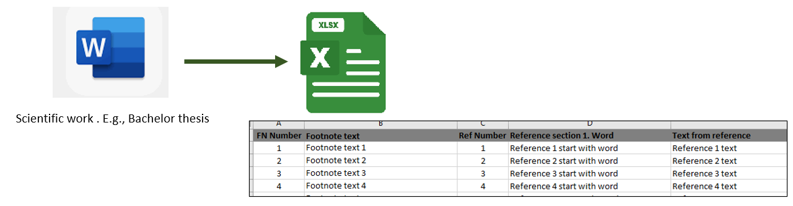

# MergeFootnotesToXlsx

- This Program can be used to map alle footnotes and references in one xls file to have a better overview, and to compare the results. 
   <b> NOTES TO THE PROGRAM </b>   
    - The word-document you want tp parse has to be in teh same location that the program 
    - The program will create a new excel file wich contains the footnote and teh reference information. 
   
  

   